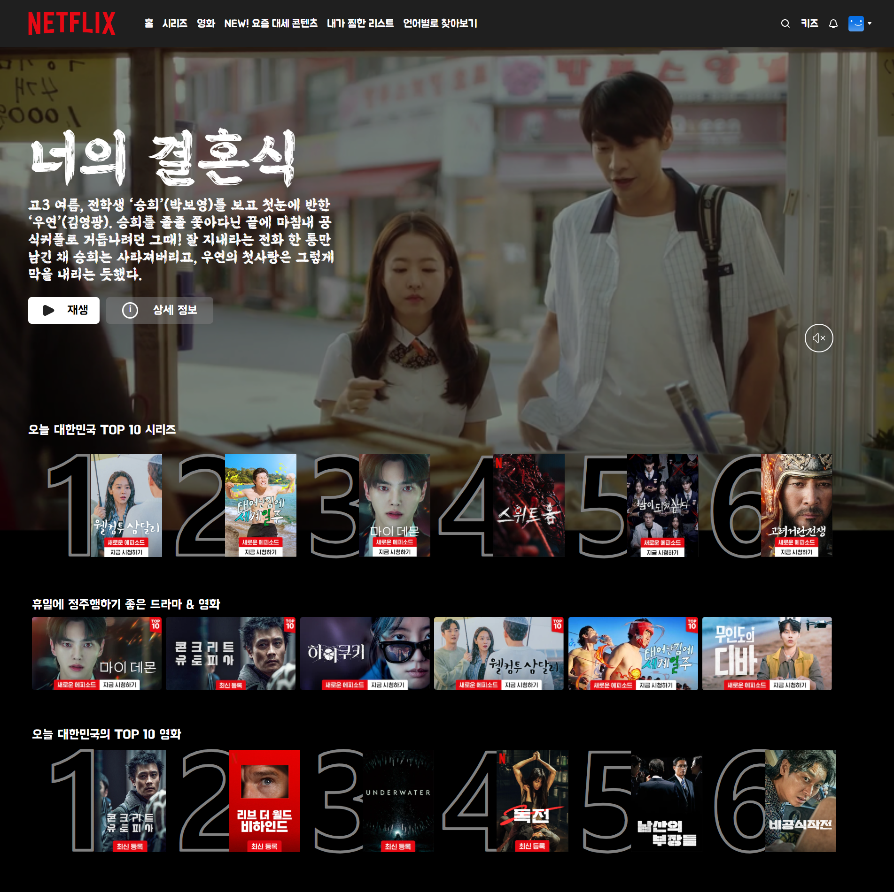

# CSS 연습

**< 넷플릭스 CSS 클론 코딩 >**
- `hover` 이벤트 처리 (이미지 확대)
- `flex` 이용 포스터 나열 및 정렬
- `@media` 브라우저 크기에 맞게 나열하는 포스터 양 및 폰트 크기 조절
- `@font-face` 폰트 임포트
- `figma` 이용 버튼 생성

1. css를 처음 다뤄봐서 컨테이너 크기들을 신경안쓰고 했더니 
모양이 예쁘지 못하다. 축소 됐을 때, `object-fit: cover`을 써야하는데, 
컨테이너가 삐져나온 것들이 많아서 쓰지 못하였다. 
브라우저 축소 시 좌우 스크롤 바가 생긴다. 
다음부턴 생각이란 걸 좀 더 해야겠다.
2. 텍스트와 이미지 조합으로 컨테이너를 만드려고 했는데, 
텍스트 공백때문에 보이는 부분을 조합하면 텍스트가 삐져 나간다. 

